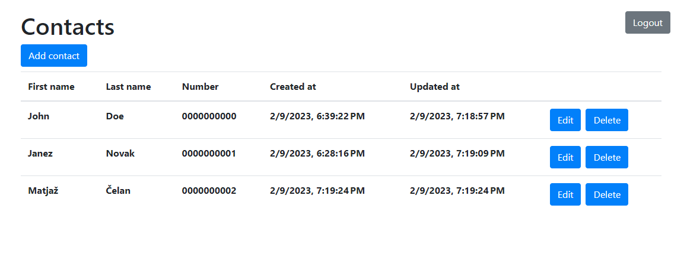
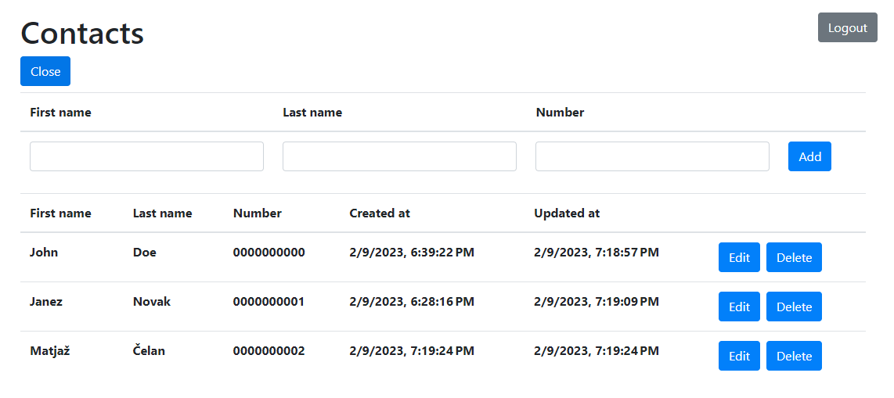
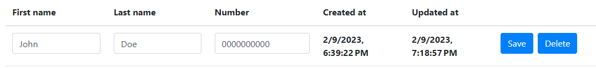
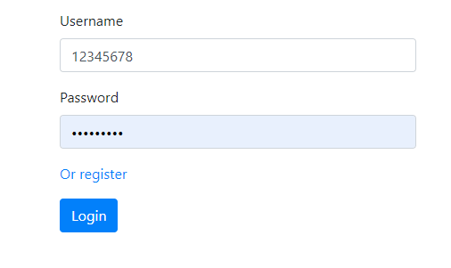
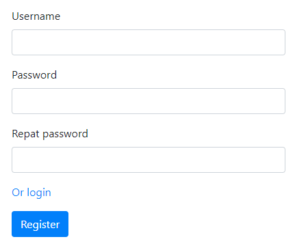
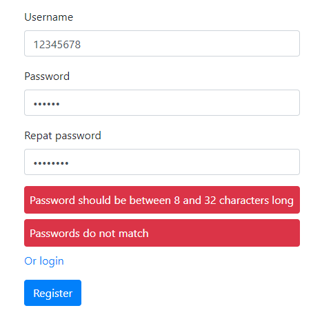

# Contact list

A simple contact list app created with Express, React and Boostrap for easy styling.
Authentication is handled with JWT tokens.

## Setup

1. Fill out the example.env with the values for the database/jwt secret/port 
2. Install packages in project folder
3. Run the script `migrate-up` to setup database in project folder
4. cd into the `client` folder and install packages there
5. Run the script `dev` inside the `client` folder to start the frontend
6. Run the script `dev-server` in project folder to start the backend

You will need to have 2 consoles open to run the scripts from points 4 and 5.

## Usage
You will first need to create an account. The webapp opens at the login page so you will need to click the register link and create an account from there. The passwords are hashed. Next, you can login with the crendentials you used to register and access the contacts site, this will save a JWT token to the local storage. You can also click the logout button to delete the token and return to the login page.

Below, there are a few examples of the layout for the contacts page and the login/register pages.

## Layout
An example of the layout of the app with 3 added contacts.

An example of the layout of the app with 3 added contacts the "Add contact" form open .

You can edit the contacts inline if you click the "Edit" button for the contact you want to edit.

Login form.

Register form.

The login and register pages also have error handling.

Example of register errors:

